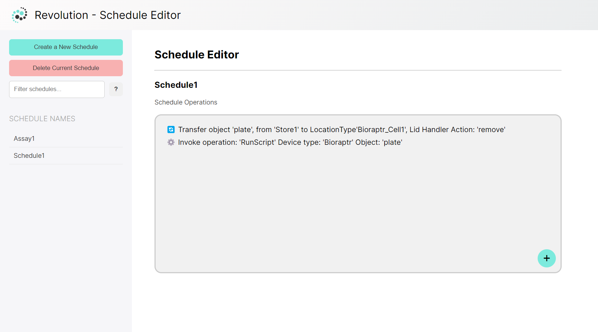

# Schedule-Editor

## Description

The Schedule Editor is a web application designed to help users manage schedules and their operations easily. It is based on current Revolution Schedule Editor. It allows users to create, duplicate, delete schedules, add operations to schedules, and filter schedules based on names. The motivation behind building this project was to provide a simpletool for organizing and tracking various operations.

This project solves the problem of managing schedules and operations manually or using complex software. By providing a user-friendly interface and intuitive functionalities, it simplifies the process of creating schedules.

## Table of Contents 

- [Usage](#usage)
- [Credits](#credits)
- [Deployment](#deployment)
- [License](#license)

## Usage
Follow these steps to effectively use Schedule Editor:

1. Create a New Schedule:
    - Click on the "Create New Schedule" button.
    - Enter a name for the new schedule when prompted.
    - Click "OK" to create the schedule.
2. Add Operations to a Schedule:

    - Click on an existing schedule from the list.
    - Click on the "Add Operation" button.
    - Follow the prompts to add a new operation to the schedule.
3. Duplicate a Schedule:

    - Right-click on an existing schedule from the list.
    - Select "Duplicate Schedule" from the context menu.
4. Delete a Schedule:

    - Right-click on an existing schedule from the list.
    - Select "Delete Schedule" from the context menu.
5. View Schedules:

    - All existing schedules and their operations will be displayed in the list.
6. Filter Schedules:

    - Use the search feature to filter schedules by name.

Schreenshot belwo shows the page with example Schedule and its operations:

## Credits

The Schedule Editor was built with inspiration from [Revolution](https://ukrobotics.tech/docs/revolution/schedule-editor/), a laboratory automation system. 

## Deployment
The deployed website is available at:

[Schedule Editor](https://cemileblks.github.io/schedule-editor/)

## License

This project is licensed under the MIT License. Please refer to the [LICENSE](./LICENSE) file for details.